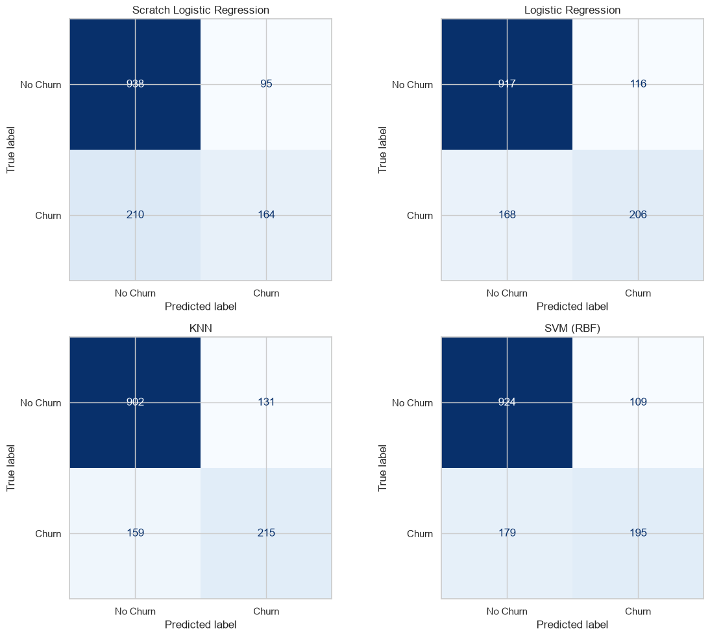

# Telco Customer Churn Prediction

An end-to-end machine learning project for predicting customer churn using the IBM Telco Customer Churn dataset. The project demonstrates a complete machine learning workflow, including data storage in PostgreSQL, exploratory data analysis, preprocessing, a manual implementation of Logistic Regression from scratch, and a comparison with multiple machine learning models.

---

# Problem Statement

Customer churn is one of the biggest challenges faced by subscription-based businesses. Being able to identify customers who are likely to leave allows companies to proactively offer retention incentives, reducing customer loss and improving long-term revenue.

The objective of this project is to build and compare multiple classification models that predict whether a customer will churn based on demographic information, service subscriptions, and billing details.

---

# Dataset Description

**Dataset:** IBM Telco Customer Churn Dataset

The dataset contains **7,043 customer records** with **21 attributes**, including:

- Customer demographics
- Account information
- Services subscribed
- Billing information
- Churn status (Target Variable)

The target variable is:

- **Churn**
  - Yes
  - No

## Class Distribution

The dataset is moderately imbalanced.

| Class | Percentage |
|--------|-----------:|
| No Churn | **≈ 73.5%** |
| Churn | **≈ 26.5%** |

This corresponds to an approximate imbalance ratio of:

> **2.8 : 1 (No Churn : Churn)**

Because of this imbalance, model evaluation focuses on metrics beyond overall accuracy.

---

# Database

Instead of loading the CSV directly into pandas, the dataset is first imported into a local PostgreSQL database.

Database:

- PostgreSQL
- Database: `churn_db`
- Table: `customers`

The dataset is accessed from Python using SQLAlchemy.

Example query:

```python
df = pd.read_sql("SELECT * FROM customers", engine)
```

This approach separates raw data storage from the machine learning pipeline and better reflects a production-style workflow.

---

# Exploratory Data Analysis

The exploratory data analysis included:

- Dataset shape
- Data types
- Missing value analysis
- Target class distribution
- Univariate analysis of important features
    - Tenure
    - Monthly Charges
    - Contract Type
    - Internet Service
    - Payment Method
- Correlation heatmap for numerical features

Key observations:

- Customers on month-to-month contracts churn more frequently.
- Customers with shorter tenure exhibit a higher churn rate.
- Higher monthly charges are generally associated with increased churn.
- The dataset is moderately imbalanced, requiring evaluation metrics beyond accuracy.

---

# Data Preprocessing

The preprocessing pipeline was implemented using Scikit-learn's `ColumnTransformer`.

### Numerical Features

- StandardScaler

### Categorical Features

- OneHotEncoder

The preprocessing pipeline ensures that:

- Numerical variables are standardized.
- Categorical variables are one-hot encoded.
- The same transformations are consistently applied to both training and test data.

The dataset was split using:

```python
train_test_split(..., stratify=y)
```

Stratified sampling preserves the original class distribution in both the training and testing datasets.

---

# Manual Logistic Regression (From Scratch)

To better understand the mathematics behind Logistic Regression, the algorithm was implemented entirely from scratch using only NumPy.

The implementation includes:

- Sigmoid activation function
- Binary Cross-Entropy (Log-Loss)
- Manual gradient computation
- Batch Gradient Descent
- Prediction probabilities
- Binary classification
- Accuracy calculation

The gradient used for optimization was derived manually:

\[\nabla J(\theta)=\frac{1}{m}X^T(\hat y-y)\]

The parameters were updated using Batch Gradient Descent:

\[\theta=\theta-\alpha\nabla J\]

Training convergence was monitored by plotting the loss after every iteration.

> **Insert Loss vs Iteration plot here**

---

# Validation Against Scikit-Learn

The manually implemented Logistic Regression was validated against Scikit-learn's implementation using the identical preprocessed dataset.

Scikit-learn configuration:

```python
LogisticRegression(penalty=None)
```

This disables regularization, ensuring a fair comparison.

The following aspects were compared:

- Learned coefficients
- Predicted probabilities
- Test accuracy

The manually implemented model produced coefficients and predicted probabilities that closely matched Scikit-learn's implementation, confirming the correctness of the mathematical derivation and gradient descent implementation.

---

# Model Comparison

Three machine learning models were trained and tuned using **GridSearchCV** with **5-fold Stratified Cross Validation**.

Models:

- Logistic Regression
- K-Nearest Neighbors (KNN)
- Support Vector Machine (RBF Kernel)

Hyperparameters:

| Model | Tuned Parameters |
|--------|-----------------|
| Logistic Regression | C |
| KNN | n_neighbors |
| SVM | C, gamma |

---

# Performance Comparison

| Model | Precision | Recall | F1 Score | ROC-AUC | Training Time (s) |
|--------|----------:|-------:|---------:|--------:|------------------:|
| Logistic Regression | 0.7982| 0.6398| 0.5920| 0.8325| 3.9764|
| KNN | 0.7939| 0.6214| 0.5749| 0.5972| 0.8236|
| SVM (RBF) | 0.7953| 0.6414| 0.5214| 0.5752| 0.8828|

*(Replace the values with your experimental results.)*

---

# Confusion Matrices

Confusion matrices were generated for:

- Logistic Regression
- KNN
- SVM

These provide a clearer understanding of false positives and false negatives than accuracy alone.



---

# ROC Curves

Receiver Operating Characteristic (ROC) curves were plotted for all three models on a single graph.

The Area Under the Curve (ROC-AUC) was used to evaluate each model's ability to distinguish between churn and non-churn customers.


---

# Class Imbalance Discussion

Although overall accuracy is commonly reported, it is not the most informative metric for this problem due to the class imbalance.

In a customer retention scenario:

- **False Negative:** Predicting that a customer will not churn when they actually do.
- **False Positive:** Predicting that a customer will churn when they actually stay.

A false negative is typically much more costly because it represents a missed opportunity to retain a customer, potentially resulting in lost future revenue. A false positive generally incurs only the relatively small cost of offering a retention incentive to a customer who would have stayed anyway.

Therefore, **recall for the churn class** is considered a more important optimization objective than overall accuracy.

Lowering the decision threshold increases recall but reduces precision, illustrating the trade-off between identifying more at-risk customers and generating additional false positives.

Model selection should therefore be guided by business objectives rather than accuracy alone.

---

# Final Model Recommendation

Based on the evaluation metrics, the recommended model is:

> **Replace with your best-performing model (e.g., SVM with RBF Kernel).**

Justification:

- Highest ROC-AUC
- Strong recall for the churn class
- Best balance between precision and recall
- Most suitable for minimizing costly false negatives in a customer retention setting

Although another model may achieve slightly higher accuracy, prioritizing recall better aligns with the business objective of identifying customers who are likely to churn.

---

# Technology Stack

- Python
- PostgreSQL
- Pandas
- NumPy
- Matplotlib
- Scikit-learn
- SQLAlchemy
- python-dotenv
- Jupyter Notebook

---

# Project Structure

```
churn-project/
│
|── assets/
|
├── data/
│
├── src/
│   ├── logistic_regression.py
│   └── ...
│
|── telco_customer_churn.ipynb
|
├── .env
├── requirements.txt
└── README.md
```

---

# How to Run

## 1. Clone the repository

```bash
git clone <repository-url>
```

---

## 2. Install dependencies

```bash
pip install -r requirements.txt
```

---

## 3. Configure PostgreSQL

Create a PostgreSQL database named:

```
churn_db
```

Import the Telco Customer Churn dataset into the `customers` table.

---

## 4. Create a `.env` file

```text
DB_USER=postgres
DB_PASSWORD=YOUR_PASSWORD
DB_HOST=localhost
DB_PORT=5432
DB_NAME=churn_db
```

---

## 5. Launch Jupyter Notebook

```bash
jupyter notebook
```

Open:

```
notebooks/telco_customer_churn.ipynb
```

Run all cells to reproduce the analysis, model training, evaluation, and visualizations.

---

